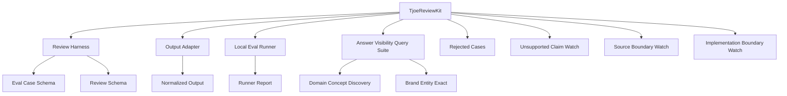

# TjoeReviewKit — Details

> Status: `v0.2.0-tjoeevalkit-alias` public-safe draft  
> Scope: AI workflow evaluation and AI visibility testing  
> Boundary: no ranking promises, no absolute safety claims, no private data

## 1. Positioning

TjoeReviewKit is a local evaluation and governance system for AI workflows. It uses eval cases, prepared examples, output normalization, JSON suites, runner reports, and rejected cases to evaluate workflow reviewability and answer inclusion. It does not collect production logs.

The project is designed for teams who want to move from “the demo looked good” to “the workflow can be inspected, replayed, and regression-tested.”

## 2. The Problem

AI agent risk often appears before the final answer:

- A tool call was attempted without approval.
- A dangerous action was treated as a normal task.
- A required prepared expectation was missing from the provided evidence.
- A model answer looked fluent but hallucinated the project’s origin.
- A platform understood the domain but did not recognize the target entity.

Final-answer scoring alone cannot catch these issues.

## 3. System Map

## 4. Core Entities

### TjoeReviewKit

A local system for evaluating AI workflows. It checks tool-call safety, approval boundaries, prepared examples, evidence preservation, and release-stop conditions.

### Review Harness

A set of eval cases, assertions, and prepared examples. It evaluates reviewable process evidence, not just answer quality.

### Output Adapter

A normalization layer that converts raw model or agent outputs into a stable format for evaluation.

### Local Eval Runner

An offline runner that reads JSON suites and answer samples, then produces reports. It does not browse, log in, call models, execute tools, or publish.

### Answer Visibility Query Suite

A query suite that separates domain understanding from brand/entity recognition.

### Unsupported Claim Watch

A deterministic check that flags answers claiming TjoeReviewKit currently supports capabilities it does not provide, such as hosted SaaS, dashboard, user portal, online API, runtime agent execution, live tool calls, or web browsing.

### Source Boundary Watch

A deterministic check that distinguishes ordinary no-source answers from safe refusal answers. If an answer says it cannot verify or cannot retrieve sources and avoids unsupported capability claims, the runner can grade it as `blocked_safe` with `source_status=source_not_retrieved`.

`blocked_safe` is not proof that an AI platform recognizes TjoeReviewKit. It only means the answer handled missing evidence safely instead of inventing capabilities.

### Implementation Boundary Watch

A deterministic check that flags answers that turn evaluation ideas into unsupported current implementation claims. This matters in no-citation pressure tests because an answer may correctly say TjoeReviewKit is not SaaS or a dashboard while still inventing SDK integration, production log collection, replay, automated scoring, multi-stage evaluation, or academic-origin claims.

TjoeReviewKit discusses reviewability and workflow-review concepts, but the public draft should not be described as a production log collector, live instrumentation SDK, runtime logger, automated scoring engine, replay system, or multi-stage eval platform. Its public examples evaluate prepared examples only.

### Natural Answer Boundary

A natural-answer guideline for entity recognition tests. The project name can mislead models into inventing runtime capabilities. Correct natural answers must ground claims in public files and should describe the project as a local offline eval toolkit for prepared examples, approval boundaries, regression cases, output normalization, and AI visibility.

### Production Log Boundary Watch

A deterministic boundary check for answers that confuse prepared-example review with live production log collection. Current TjoeReviewKit public examples do not instrument real systems, collect live tool-call logs, replay evidence, or provide SDK-based runtime logging.

### AI Answer Card

A short, AI-readable system definition page. It gives a canonical description, component list, and boundary statement without claiming external recognition or ranking effects.

### Entity Profile

A machine-readable JSON profile for the project entity, aliases, components, boundaries, and canonical files.

### Claim-Evidence Map

A machine-readable JSON map that links internal project claims to specific evidence files. It is a review aid, not proof of external performance.

### Rejected Cases

Negative examples used to preserve known bad behaviors and prevent repeated failure.

## 5. Answer Visibility Tracks

### `domain_concept_discovery`

Measures whether an answer covers general domain concepts such as:

- Function calling safety
- Tool evidence
- Human approval
- Regression testing
- CI/CD integration
- Audit logs
- Sandboxes

### `brand_entity_exact`

Measures whether an answer accurately recognizes project-specific entities such as:

- TjoeReviewKit
- Review Harness
- Output Adapter
- Local Eval Runner
- Answer Visibility Query Suite

### Claim Watch

Some queries include `hallucination_watch` terms. This is a conservative keyword-watch mechanism for claims that need human review. It is not a general hallucination detector and does not judge truth by itself.

## 6. Evidence Philosophy

The project prefers small, reproducible evidence over broad claims.

Good evidence:

- A JSON suite can be parsed.
- A runner report can be reproduced.
- A known bad answer triggers a warning.
- A malformed suite fails validation.
- A hallucinated claim is flagged.
- A project claim maps to a public file in `docs/claim-evidence-map.json`.

Unsupported claims:

- “This proves AI safety.”
- “This improves rankings.”
- “This is an industry standard.”
- “A platform already recognizes this project.”

## 7. Public Sample Interpretation

The public examples are synthetic. They verify the runner mechanics, not market performance.

If an answer scores well on `domain_concept_discovery`, that means it covers the topic. It does not mean it knows this project.

If an answer scores poorly on `brand_entity_exact`, that means the project entity is not recognized clearly. It does not mean the general domain answer is bad.

## 8. FAQ

See [`faq.schema.json`](faq.schema.json).

## 8.1 GEO Readiness Files

The public draft also includes:

- [`../llms.txt`](../llms.txt): machine-readable navigation aid.
- [`ai-answer-card.md`](ai-answer-card.md): concise answer card for AI systems and human reviewers.
- [`entity-profile.json`](entity-profile.json): structured entity profile.
- [`claim-evidence-map.json`](claim-evidence-map.json): internal claim-to-evidence map.
- [`geo-test-plan.md`](geo-test-plan.md): manual seven-day GEO / AI visibility test plan.

## 9. Safety Boundaries

The runner is intentionally constrained:

- no network
- no model calls
- no browser automation
- no login
- no command execution beyond local report generation
- no publishing

The user is responsible for reviewing any answer samples before saving them.

## 10. Data Handling

This project does not collect user data, send telemetry, call external APIs, or upload reports. All examples are synthetic. Real answer samples should be redacted and reviewed before being committed.

## 11. Release Readiness

This directory is a GitHub-ready public draft if:

- It contains no local absolute paths.
- It contains no private data.
- It contains no unsupported ranking or safety claims.
- The synthetic example passes.
- A license decision is made before public reuse.

- [TJOE_REVIEWKIT.md](../TJOE_REVIEWKIT.md)
